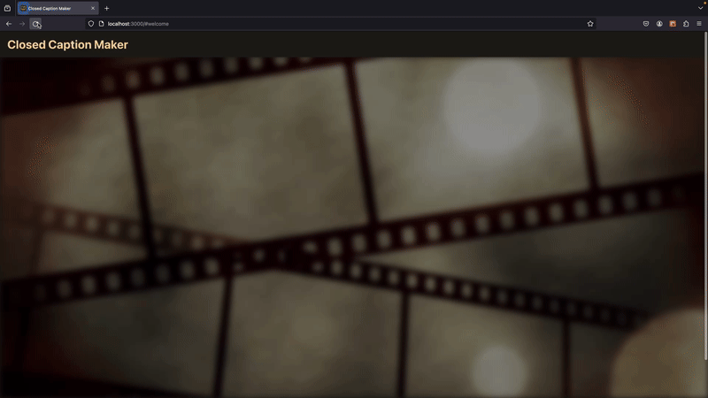

  

## What is Closed Caption Maker?

Closed Caption Maker allows you to generate a transcript and then add subtitles for your videos. After generating the subtitles the custom editor allows you to make edits to the generated transcript and even translate the subtitles to any of the [supported languages](https://github.com/gAlexander77/Closed-Caption-Maker/blob/main/frontend/src/pages/Home/supportedLanguages.tsx). Once you are satisfied with the final transcript you can then request a download of your video with the subtitles embedded into the video.

## Technology Used

### [Frontend](https://github.com/gAlexander77/Closed-Caption-Maker/tree/main/frontend)

-   TypeScript
-   React JS
-   CSS

### [Backend](https://github.com/gAlexander77/Closed-Caption-Maker/tree/main/backend)

-   Python
-   Flask

## Preview

### Generating the Transcript

### Edit and Undo Changes

### Translate Transcript

